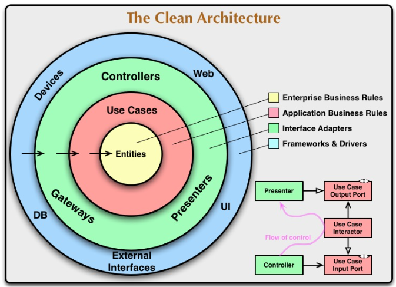
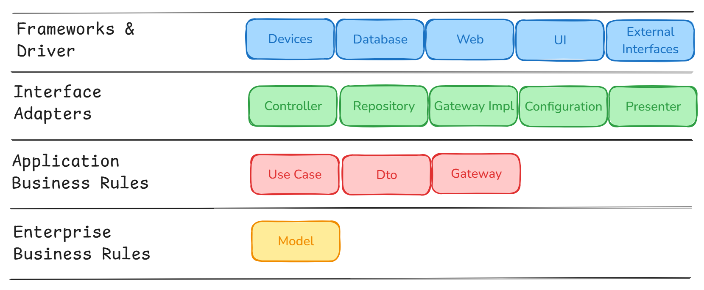

# Clean Architecture

## Overview
This project follows the Clean Architecture principles, ensuring a clear separation of concerns and maintainability. It is built using Java 17 and Spring Boot 3.4.3, and integrates Kafka, MySQL, FlywayDB, JPA, ModelMapper, Lombok, Spring MVC, and Docker.

## Technologies Used
- Java 17 & Spring Boot 3.4.3
- Golang 1.20

## Clean Architecture Layers
Clean Architecture organizes the project into four main layers, ensuring separation of concerns and flexibility:

### 1. Enterprise Business Rules (Entities)
- This layer contains core business logic and domain entities.
- It is independent of any frameworks, databases, or external dependencies.

### 2. Application Business Rules (Use Cases)
- Contains application-specific business logic (e.g., services and use cases).
- Implements use case logic without being dependent on external frameworks.

### 3. Interface Adapters (Gateways, Controllers, and Presenters)
- Translates data between the application and external sources (APIs, databases, etc.).
- Contains Controllers (handling HTTP requests) and Gateways (handling data persistence).

### 4. Frameworks & Drivers (Infrastructure Layer)
- Implements framework-specific details such as database connections, messaging queues, and web frameworks.
- Includes Spring Boot, JPA, Kafka, Flyway, and Docker.

## Getting Started
### Prerequisites
- Install Java 17, Docker, and Docker Compose
- Golang 1.20
- Install MySQL 8.0 (or use Docker)

## Conclusion
This project applies Clean Architecture principles to create a modular, scalable, and maintainable application. It ensures flexibility and separation of concerns, making it easy to test, extend, and integrate with new technologies.

For contributions or inquiries, feel free to create a pull request or open an issue.